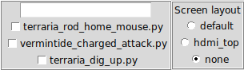

# crocohotkey 
Why need auto hotkey when you can use a real language like python to make any macro, mouse and/or keyboard?
This repo aim to provide some pynput script example as well as a gui written in tk to quickly enable/disable any scripts

## Dependencies
* Tkinter should come by default with python if not you can try `apt-get install python3-tk` for debian based system
* pynpyut
    * pip `pip install pynput`
    * deb `apt instal python3-pynput`
    * aur `yay -Sy python3-pynput`

## Screenshot

